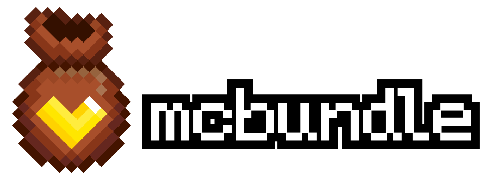

<h1 align="center"></h1>

CLI bundler for *Minecraft: Bedrock Edition* add-on development, inspired by modern web tooling.
----------------------------------------------------------------------------------------------

> ⚠️ **Early Development**  
> mcbundle is still experimental. Expect changes, incomplete features, and occasional bugs.  
> Not recommended for production projects (yet), but perfect if you’d like to explore, test, and help shape its future.

## ❔ About

Its goal is to make content creation for *Minecraft: Bedrock Edition* faster, more organized, and more elegant.

### ⚙️ Key Features

- **One recipe, one source**  
  Define everything in a single `recipe.json` — no need to maintain separate `manifest.json` files.

- **First-class JS/TS bundling**  
  Automatically detects native `@minecraft` imports and injects them into your manifest dependencies. Ready to run, no extra config.

- **Simple, straightforward commands**  
  Build, deploy directly to Minecraft, and package your project into `.mcpack` or `.mcaddon` formats — with just a few commands.

- **Module-based structure**  
  Organize by modules like `resources`, `data`, and `server` (`script`) instead of splitting into separate packs.

### 📝 Coming Soon

- **Content analysis** — The tool will be aware of your add-on’s content.
- **Recipe profiles** — Save multiple configurations under different namespaces.
- **`recipe.user.json`** — Local, user-specific configuration.
- **Centralized manifest translations** — Manage `pack.name` and `pack.description` in one place.  
  > Currently, translating these keys requires creating `.lang` files in both `data` and `resources` modules.  
  > `.lang` files make sense in the `resources` module, but not in `data`.
- **JS/TS API** — Extend mcbundle with hooks, plugins, and more.


--------------------------------------------------------------------------------------------

## 🚀 Getting Started

Run [`create-mcbundle`](https://www.npmjs.com/package/create-mcbundle) with your favorite package manager:

> The project *will* be generated in the current working directory.

```sh
npm create mcbundle@latest
```
```sh
yarn create mcbundle@latest
```
```sh
pnpm create mcbundle@latest
```
```sh
bun create mcbundle@latest
```

For next steps, please refer to the [documentation](https://github.com/n-loco/mcbundle/wiki).

--------------------------------------

## 🛠️ Building mcbundle

### Requirements

Make sure you have the following installed:

- **Go** — v1.13 or newer
- **GNU Make** — v4.4 or newer
- **Node.js** — v22.14 or newer
- **PNPM** — v10.8 or newer

### Setup

Install all dependencies and prepare the workspace:

```sh
make setup
```

### Build

Build for your current platform:

```sh
make
```

Build for all supported platforms (cross-compile):

```sh
make build-cross
```

> 💡 **Tip**  
> Set the `BUILD_MODE` environment variable to `release`
> to generate optimized binaries and minified JavaScript for distribution.

--------------------------------------------------------------------
