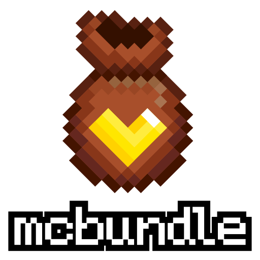

# mcbundle logo




--------------------------------------------------------------------------------

## License

The mcbundle logo and its official variations © 2025 by Nícolas Rickes dos Santos are licensed under **CC BY 4.0**.

- See [`LICENSE`](./LICENSE) or visit: https://creativecommons.org/licenses/by/4.0/
- [Third-party notices](./THIRD_PARTY.md)

### Additional Usage Terms

The mcbundle logo is part of the project's visual identity and must not be used in a way that suggests endorsement, sponsorship, or official partnership without prior written permission.

You **may**:
- Use the logo to represent the official project or forks that are still clearly related to mcbundle.
- Include it in thumbnails, articles, reviews, tutorials and other recreational contexts.
- *Adapt its size or format for technical needs.
- *Adapt the logo for different visual contexts.

You **may not**:
- Use the logo in connection with unlawful, misleading, or offensive content.
- Use it as part of another logo or trademark.
- *Use the original logo (or very close variations) to represent an independent project or a derivative project that is not the official mcbundle.
  - Example: creating a new project called "mcbundle4j" or a fork called “neobundle” using the original logo or only making minimal changes.

About adaptations*:  
If you are adapting the logo to fit in a specific context (by technical or style reasons):
- Make sure the logo is recognizable.

If you create an independent project or a fork that becomes a new product
and wants to use the logo as a base:
- Clearly change the logo (colors, shapes, or elements) so it can be distinguished from mcbundle’s visual identity.
- Keep attribution to the original logo when applicable.

> The goal is not to limit creativity, but to preserve mcbundle’s visual identity so everyone can easily recognize it.

When credit is required under CC BY 4.0, use:

```
mcbundle logo © 2025 by Nícolas Rickes dos Santos, licensed under CC BY 4.0.
```

--------------------------------------------------------------------------------------